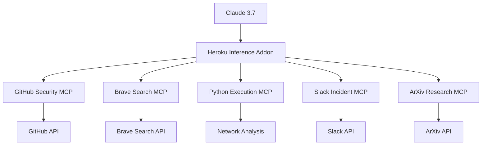

# Hosted MCP Tools for AI Agent Orchestration

## 5 Security-Focused Model Context Protocol Servers

**Deployed on Heroku • Integrated with Claude 3.7 • Ready for Production**

<div class="pt-12">
  Built with FastMCP, FastAPI, and Uvicorn
</div>

<div class="abs-br m-6 flex gap-2">
  <a href="https://github.com/benjaminrust" target="_blank" alt="GitHub"
    class="text-xl slidev-icon-btn opacity-50 !border-none !hover:text-white">
    <carbon-logo-github />
  </a>
</div>

---
layout: image-right
image: https://images.unsplash.com/photo-1555066931-4365d14bab8c?ixlib=rb-4.0.3&ixid=M3wxMjA3fDB8MHxwaG90by1wYWdlfHx8fGVufDB8fHx8fA%3D%3D&auto=format&fit=crop&w=2070&q=80
---

# What We Built

## 5 Hosted MCP Tools

- **GitHub Security MCP** - Repository vulnerability analysis
- **Brave Search Threat Intelligence** - CVE database and threat search  
- **Python Execution Network Analysis** - Security data analysis and risk scoring
- **Slack Incident Response** - Security team communication and alerting
- **ArXiv Research MCP** - Academic security research and threat intelligence

All integrated with **Claude 3.7 Inference Addon** on Heroku for seamless AI agent orchestration.

---
layout: default
---

# GitHub Security MCP

## Repository Vulnerability Analysis

<div class="grid grid-cols-2 gap-4">

<div>

### Features
- **Dependency Scanning** - Detect vulnerable packages
- **Secret Detection** - Find exposed credentials
- **Code Analysis** - Identify security issues
- **Compliance Checks** - Ensure security standards

### Use Cases
- Automated security audits
- CI/CD pipeline integration
- Compliance reporting
- Risk assessment

</div>

<div>

### Technical Stack
```python
# FastMCP + FastAPI
from fastmcp import FastMCP
from fastapi import FastAPI

app = FastAPI()
mcp = FastMCP(app)

@mcp.tool()
async def scan_repository(repo_url: str):
    # Security analysis logic
    return vulnerability_report
```

</div>

</div>

---
layout: default
---

# Brave Search Threat Intelligence

## CVE Database & Threat Search

<div class="grid grid-cols-2 gap-4">

<div>

### Capabilities
- **CVE Lookup** - Real-time vulnerability data
- **Threat Intelligence** - Latest security threats
- **IOC Search** - Indicator of compromise analysis
- **Risk Scoring** - Automated threat assessment

### Data Sources
- Brave Search API
- CVE databases
- Threat feeds
- Security advisories

</div>

<div>

### Integration
```python
@mcp.tool()
async def search_cve(cve_id: str):
    # Query Brave Search + CVE databases
    return {
        "cve_id": cve_id,
        "severity": "HIGH",
        "description": "...",
        "mitigation": "..."
    }
```

</div>

</div>

---
layout: default
---

# Python Execution Network Analysis

## Security Data Analysis & Risk Scoring

<div class="grid grid-cols-2 gap-4">

<div>

### Analysis Features
- **Network Traffic Analysis** - Monitor connections
- **Behavioral Analysis** - Detect anomalies
- **Risk Scoring** - Calculate threat levels
- **Forensic Analysis** - Investigate incidents

### Security Capabilities
- Real-time monitoring
- Threat detection
- Incident response
- Compliance reporting

</div>

<div>

### Implementation
```python
@mcp.tool()
async def analyze_network_traffic(pcap_file: str):
    # Network analysis logic
    return {
        "suspicious_connections": [...],
        "risk_score": 0.85,
        "recommendations": [...]
    }
```

</div>

</div>

---
layout: default
---

# Slack Incident Response

## Security Team Communication & Alerting

<div class="grid grid-cols-2 gap-4">

<div>

### Incident Management
- **Real-time Alerts** - Instant security notifications
- **Team Coordination** - Streamlined communication
- **Incident Tracking** - Centralized management
- **Automated Responses** - Quick mitigation actions

### Integration Points
- Security tools
- Monitoring systems
- Ticketing systems
- Communication platforms

</div>

<div>

### Workflow
```python
@mcp.tool()
async def create_incident(severity: str, description: str):
    # Create Slack incident channel
    # Notify security team
    # Initiate response procedures
    return incident_id
```

</div>

</div>

---
layout: default
---

# ArXiv Research MCP

## Academic Security Research & Threat Intelligence

<div class="grid grid-cols-2 gap-4">

<div>

### Research Capabilities
- **Paper Search** - Find relevant security research
- **Trend Analysis** - Identify emerging threats
- **Citation Analysis** - Track research impact
- **Knowledge Extraction** - Extract key insights

### Use Cases
- Threat intelligence
- Research validation
- Academic collaboration
- Innovation tracking

</div>

<div>

### Search Interface
```python
@mcp.tool()
async def search_papers(query: str, category: str = "cs.CR"):
    # Query ArXiv API
    return {
        "papers": [...],
        "trends": [...],
        "insights": "..."
    }
```

</div>

</div>

---
layout: center
class: text-center
---

# Heroku Integration

## Claude 3.7 Inference Addon

<div class="grid grid-cols-3 gap-4 mt-8">

<div class="text-center">
  <div class="text-4xl mb-2">🚀</div>
  <h3>Deployment</h3>
  <p>Easy deployment with Heroku CLI</p>
</div>

<div class="text-center">
  <div class="text-4xl mb-2">⚡</div>
  <h3>Performance</h3>
  <p>Auto-scaling and high availability</p>
</div>

<div class="text-center">
  <div class="text-4xl mb-2">🔒</div>
  <h3>Security</h3>
  <p>Enterprise-grade security features</p>
</div>

</div>

---
layout: default
---

# Architecture Overview

## MCP Server Integration



---
layout: center
class: text-center
---

# Benefits

## Why Hosted MCP Tools?

<div class="grid grid-cols-2 gap-8 mt-8">

<div class="text-left">
  <h3>🔧 **Operational Excellence**</h3>
  <ul class="text-left">
    <li>Zero infrastructure management</li>
    <li>Automatic scaling</li>
    <li>High availability</li>
    <li>Built-in monitoring</li>
  </ul>
</div>

<div class="text-left">
  <h3>🛡️ **Security First**</h3>
  <ul class="text-left">
    <li>Enterprise-grade security</li>
    <li>Compliance ready</li>
    <li>Audit trails</li>
    <li>Secure API access</li>
  </ul>
</div>

</div>

---
layout: center
class: text-center
---

# Next Steps

## Getting Started

<div class="grid grid-cols-3 gap-4 mt-8">

<div>
  <h3>1. Deploy</h3>
  <p>Use our deployment scripts to get started quickly</p>
</div>

<div>
  <h3>2. Configure</h3>
  <p>Set up your API keys and environment variables</p>
</div>

<div>
  <h3>3. Integrate</h3>
  <p>Connect with Claude 3.7 and start orchestrating</p>
</div>

</div>

<div class="mt-8">
  <a href="https://github.com/benjaminrust" target="_blank" class="btn">
    View on GitHub
  </a>
</div>

---
layout: center
class: text-center
---

# Thank You!

## Questions & Discussion

<div class="mt-8">
  <p>Ready to build secure, scalable AI agent orchestration?</p>
  <p>Let's make security automation a reality.</p>
</div>

<div class="mt-8 flex justify-center gap-4">
  <a href="https://github.com/benjaminrust" target="_blank" class="btn">
    GitHub
  </a>
  <a href="https://heroku.com" target="_blank" class="btn">
    Heroku
  </a>
</div>
